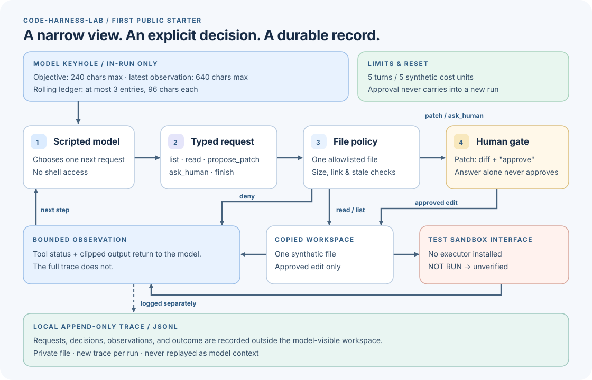

# code-harness-lab

I want to understand what makes human-AI collaboration on code trustworthy over
time: a model's narrow view, a person's right to say no, and a record that
survives the moment without being mistaken for proof. This repo starts with the
smallest loop I can inspect end to end.



[Read the diagram as text](docs/diagram.txt) or the
[350–500-word project proposal](docs/proposal.md).

## Try the one-file experiment

Requires Python 3.12 on a POSIX system. From a fresh checkout:

```sh
python3.12 -m venv .venv
.venv/bin/python -m pip install -e '.[dev]'
.venv/bin/python -m code_harness_lab --output .code-harness-runs/my-first-run
.venv/bin/python -m pytest
```

The scripted `FakeModel` lists and reads a copy of
[`fixtures/calculator.py`](fixtures/calculator.py), then proposes changing
subtraction to addition. The CLI displays the diff. Type **`approve`** to
apply it; press Enter (or provide no input) to leave the file alone. Choose a
new `--output` directory each time, or omit the option for an automatically
named run. By default, the copied workspace and private `trace.jsonl` live in
ignored `.code-harness-runs/`; a custom output path is yours to manage.
Tracked source files are untouched. No API key or network connection is used
by the demo.

An approved edit ends as **`unverified`** because no isolated executor is
installed to run candidate code. A refused edit ends as **`unchanged`**. The
CLI prints `NOT RUN` for candidate-code tests in either case; `pytest` above
tests the trusted harness itself, not the proposed fix.
The push/PR workflow runs that same trusted test suite without executing
candidate code or contacting a model.

## What this starter makes visible

The model can request `list`, `read`, `propose_patch`, `ask_human`, or `finish`;
it cannot request a shell command. One allowlisted UTF-8 file is exposed.
The runner caps observations and its short in-run ledger, reserves synthetic
cost units before each model call, and stops at a hard turn limit. Patch
approval is a separate decision from answering a question. The append-only
trace records decisions locally but is never replayed into model context.
Runs do not resume or inherit approval.

The allowlist is an application-level boundary, not an OS sandbox. The demo
uses only a generated synthetic workspace; keep real repositories and secrets
out until an isolated test runner and stronger boundaries exist.

The [design](docs/design.md) explains the invariants, the
[research notes](docs/research.md) distinguish source ideas from implemented
behavior, and the [roadmap](docs/roadmap.md) lists the next experiments.
Original code and diagram are MIT-licensed under [LICENSE](LICENSE).
